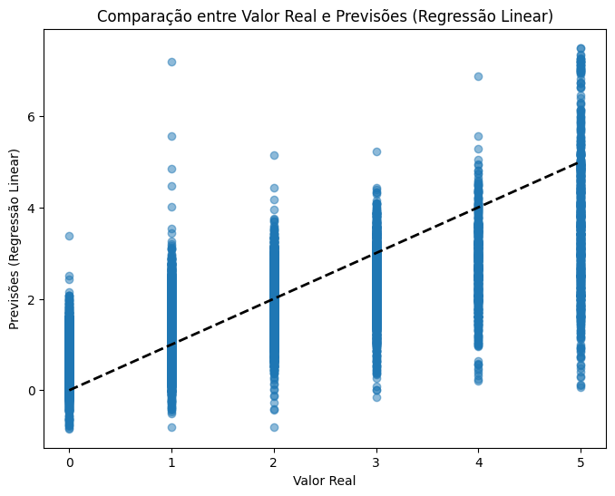
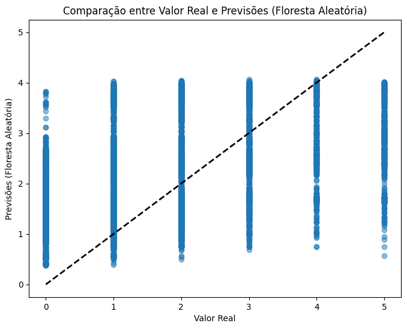
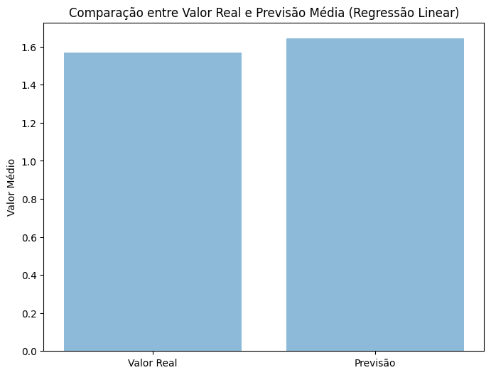
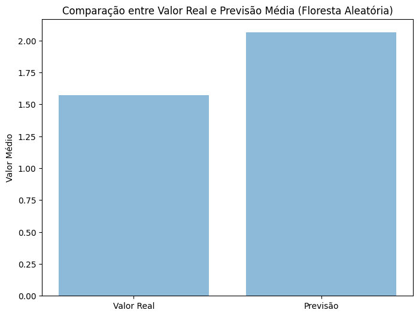

 # Projeto pessoal: Predição de Preços de Imóveis - California Housing 

**Descrição do Projeto:**
Este projeto tem como objetivo construir modelos de machine learning para prever os preços de imóveis na Califórnia, utilizando dados do conjunto de dados "California Housing". Serão explorados dois modelos: regressão linear e regressão de floresta aleatória. Além disso, será realizada a busca de hiperparâmetros usando GridSearchCV para otimizar o modelo de floresta aleatória.

**Descrição do Conjunto de Dados:**

O conjunto de dados possui as seguintes colunas (características):
1. `MedInc`: Mediana da renda dos blocos.
2. `HouseAge`: Mediana da idade das casas dos blocos.
3. `AveRooms`: Média do número de cômodos por domicílio.
4. `AveBedrms`: Média do número de quartos por domicílio.
5. `Population`: População do bloco.
6. `AveOccup`: Média da ocupação por domicílio.
7. `Latitude`: Latitude da localização do bloco.
8. `Longitude`: Longitude da localização do bloco.

A coluna alvo (variável dependente) é a `MedHouseValue`, que representa a mediana do valor das casas nos blocos em milhares de dólares.

**Origem do Conjunto de Dados:**

O conjunto de dados "California Housing" foi adaptado de um conjunto de dados disponível no repositório de conjuntos de dados do StatLib da Universidade Carnegie Mellon. A versão mais amplamente utilizada foi criada por Pace, R. Kelley e Ronald Barry e foi publicada originalmente no artigo "Sparse Spatial Autoregressions", Statistics and Probability Letters, 33 (1997), páginas 291-297.

O conjunto de dados foi coletado pelo United States Census Bureau e acredita-se que os dados foram obtidos a partir do censo de 1990. As informações geográficas, como latitude e longitude, permitem que os dados sejam mapeados geograficamente e analisados em termos de distribuição espacial dos preços dos imóveis na Califórnia.

**Pré-processamento dos Dados:**
Antes de ajustar os modelos, realizou-se o pré-processamento dos dados, incluindo a remoção de valores ausentes, padronização das características e transformação logarítmica em algumas colunas específicas. Isso foi feito para garantir que os dados estejam em um formato adequado para o ajuste dos modelos.

**Resultados:**
Após o treinamento e avaliação dos modelos nos dados de teste, foram obtidos os seguintes resultados:

- R² do modelo de regressão linear nos dados de teste: 0.5213
- R² do modelo de floresta aleatória nos dados de teste originais: -0.0256
- R² do melhor modelo de floresta aleatória após busca de hiperparâmetros: -0.1205
- R² do melhor modelo de floresta aleatória sem busca de hiperparâmetros:-1.5212 

**Interpretação dos Resultados:**

Observou-se que o modelo de regressão linear obteve um R² de 0.5213, indicando que ele consegue explicar aproximadamente 52.13% da variabilidade nos preços dos imóveis. Já o modelo de floresta aleatória apresentou resultados diferentes, com um R² negativo tanto após a busca de hiperparâmetros (-0.1205) quanto sem a busca de hiperparâmetros (-1.5212).

É importante notar que os valores negativos de R² para o modelo de floresta aleatória sugerem que esse modelo não se ajustou bem aos dados de teste originais e pode estar sofrendo de overfitting. A busca de hiperparâmetros usando GridSearchCV não produziu uma melhora significativa no desempenho do modelo de floresta aleatória.

**Visualização dos Resultados:**
A seguir, são apresentados os gráficos de dispersão que comparam os valores reais do conjunto de teste com as previsões feitas pelos modelos de regressão linear e floresta aleatória.

1. Gráfico de Dispersão - Comparação entre Valor Real e Previsões (Regressão Linear):

2. Gráfico de Dispersão - Comparação entre Valor Real e Previsões (Floresta Aleatória):

3. Gráfico de Barras - Comparação entre Valor Real e Previsão Média (Regressão Linear):

4. Gráfico de Barras - Comparação entre Valor Real e Previsão Média (Floresta Aleatória):

**Conclusão:**
Com base nos resultados obtidos, o modelo de regressão linear apresentou um melhor desempenho em relação aos modelos de floresta aleatória nos dados de teste originais. Entretanto, os resultados negativos de R² para os modelos de floresta aleatória sugerem que ambos os modelos podem ser aprimorados através de mais experimentação com seleção de características, ajuste de hiperparâmetros e outras técnicas de pré-processamento.

É importante continuar explorando diferentes abordagens para melhorar os modelos e entender melhor os fatores que influenciam os preços dos imóveis na Califórnia. A busca de hiperparâmetros usando GridSearchCV não produziu uma melhora significativa no desempenho dos modelos de floresta aleatória, o que sugere que outras técnicas podem ser necessárias para melhorar sua performance.

No geral, este projeto pode servir como ponto de partida para futuras análises mais aprofundadas e ajustes adicionais nos modelos, a fim de obter previsões mais precisas dos preços dos imóveis na Califórnia.
